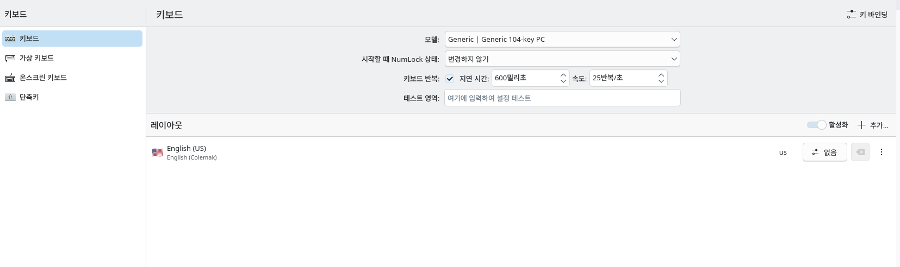

나는 이번달 초에 영어 자판을 콜맥으로 바꿨다. 그리고 나는 한국어 사용자이기도 하다. 내가 겪었던 문제 몇개를 써보겠다.

## 리눅스 입력기

리눅스에서 한글 IME를 설정하는게 어렵다는건 한번쯤 들어봤을거라고 생각한다. 나 또한 리눅스를 처음 썼을 때 한글 타자가 제대로 되지 않아서 열심히 삽질했던 기억이 난다. 한글 사용자도 소수라 지원이 제대로 되지 않는데, 한글에 콜맥까지 쓰는 경우는 소수중에서도 소수이다. 얼마나 험난한 길이겠는가.

내가 겪었던 첫번째 문제는 비밀번호를 입력할 때만 입력이 쿼티로 되는 문제였다. 정말 이상한점이 또 입력한 비밀번호 보기 옵션을 켜놓고 입력하면 제대로 콜맥 자판으로 입력된다. 내 생각에는 이 문제가 입력한 비밀번호를 가리면서 입력되게 하느라 쿼티를 약간 하드코딩해놓거나 입력기(Fcitx5)를 우회해서 입력된다고 생각했다. 실제로도 비슷한 이유인 것 같다.

나는 그래서 이 문제를 해결하기 위해 입력기에서만 자판을 바꾸지 말고 KDE의 시스템 설정에서 레이아웃을 변경해보았다. 그랬더니 더 이상한 상황이 나왔다.

<figure class="captioned-figure">

<figcaption>ㄴㄷㄱ긴ㅇㄷㅎ;너! ㄴㄷ 냐ㅔㅜ 노뇨샤ㅛ (안녕하세요! 아 이거 왜이래)</figcaption>
</figure>

한글 타자가 콜맥 자판처럼 변했다. 한글 레이아웃도 콜맥에 맞게 변형 된 것 같다. 정말 이상한 상황이다. 나는 리눅스를 잘 알지 못하므로 이 상황을 해결하기 위해 ChatGPT와 의논해보았지만 해결하지 못했다. 결국 포기했다. 비밀번호 입력할 때만 쿼티로 입력하기로 했다.

참고로 나는 Kubuntu 26.04 (Wayland)를 사용한다. 해결 방법을 안다면 제발 댓글로 알려주세요.

## 윈도우 입력기

나는 윈도우에서만 작동하는 앱들을 사용하기 위해 리눅스와 윈도우를 듀얼부팅한다. Windowslop을 쓰고싶진 않지만 어쩔수 없다. 아무튼 윈도우에서만 쿼티를 쓸수는 없으니 윈도우 자판도 콜맥으로 바꾸기로 했다.

뭐 이 과정은 그렇게까지 험난하지 않았다. 아무래도 상용 운영체제는 확실히 좀 다른것같다. 돈주고 판매하는 소프트웨어가 이런걸까? 나는 윈도우에서 콜맥을 사용하는 방법을 검색해봤고, 윈도우 네이티브로는 안된다는걸 깨달았다(될수도 있지만 적어도 내가 찾지는 못했다.). 결국 [날개셋 입력기](http://moogi.new21.org/prg4.html)를 설치했다. 정말 좋은 소프트웨어이니 꼭 기억하고 3벌식을 사용하고싶다면 꼭 써봐라.

날개셋이라는 정말 좋은 프로그램 덕분에 윈도우에서는 콜맥에 한글을 잘 사용할수 있게 되었지만... 윈도우는 나에게 뒷전일 뿐이다. 리눅스에서는 아직도 잘 안된다. 이상하다. 

## 결론

이걸 보는 여러분들은 홍대병 걸리지 마시고 콜맥 이딴거 쓰지 마시라. 그냥 쿼티나 써라. 쿼티가 최고다. 근데 나는 콜맥 쓸거긴함
